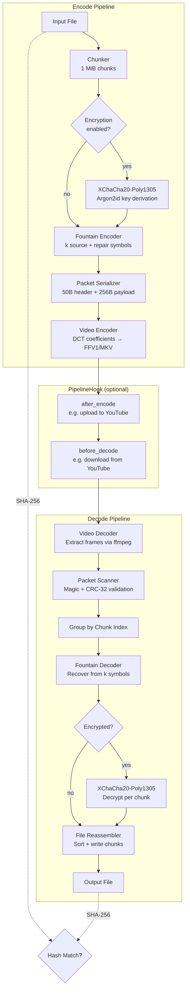

# yts3

**YouTube as S3** — encode arbitrary files into lossless video for cloud storage.

yts3 converts any file into an FFV1/MKV lossless video by embedding data into 8×8 DCT blocks across 4K grayscale frames. Upload the video to YouTube (or any video host), and download it later to recover the original file.

## Features

- **Lossless encoding** — FFV1 codec in MKV container at 4K (3840×2160) 30fps
- **DCT steganography** — data embedded in low-frequency DCT coefficients of 8×8 pixel blocks
- **Fountain codes** — XOR-based erasure coding with configurable redundancy for surviving re-encoding
- **Encryption** — optional XChaCha20-Poly1305 with Argon2id key derivation
- **Streaming I/O** — buffered chunked reads, constant memory regardless of file size
- **Parallel processing** — chunk encoding/decoding parallelized via rayon
- **Fully configurable** — resolution, FPS, bits/block, coefficient strength, chunk size, repair overhead
- **Pipeline hooks** — inject custom logic between encode and decode (e.g. upload to YouTube)

## Installation

**Requirements:** Rust 1.70+, FFmpeg on `$PATH`

```bash
cargo install --path .
```

Or build from source:

```bash
cargo build --release
```

## Usage

### CLI

#### Encode a file into video

```bash
yts3 encode --input myfile.zip --output encoded.mkv
```

#### Encode with encryption

```bash
yts3 encode --input myfile.zip --output encoded.mkv --password "my secret"
```

#### Decode a video back to file

```bash
yts3 decode --input encoded.mkv --output recovered.zip
```

#### Decode with password

```bash
yts3 decode --input encoded.mkv --output recovered.zip --password "my secret"
```

#### Custom parameters

```bash
yts3 encode \
  --input myfile.zip \
  --output encoded.mkv \
  --width 1920 \
  --height 1080 \
  --fps 60 \
  --bits-per-block 1 \
  --coefficient-strength 200.0 \
  --chunk-size 524288 \
  --repair-overhead 1.5
```

> When decoding, `--width`, `--height`, `--bits-per-block`, and `--coefficient-strength` must match the values used during encoding.

### API

Add yts3 as a dependency in your `Cargo.toml`:

```toml
[dependencies]
yts3 = { git = "https://github.com/freddiev4/yts3" }
```

#### Encode and decode a file

```rust
use std::path::Path;
use yts3::{encode_file, decode_file, Yts3Config};

let cfg = Yts3Config::default();

encode_file(Path::new("input.txt"), "encoded.mkv", Some("my-password"), &cfg)?;
decode_file("encoded.mkv", Path::new("output.txt"), Some("my-password"), &cfg)?;
```

#### Roundtrip with a custom hook

Implement `PipelineHook` to inject logic between encode and decode — for example
uploading the video to YouTube and downloading it back before decoding:

```rust
use std::path::{Path, PathBuf};
use anyhow::Result;
use yts3::{roundtrip, PipelineHook, Yts3Config};

struct YoutubeHook;

impl PipelineHook for YoutubeHook {
    fn after_encode(&self, encoded_path: &Path) -> Result<PathBuf> {
        // upload encoded_path to YouTube ...
        let video_id = youtube_upload(encoded_path)?;

        // download it back to a local file ...
        let downloaded = youtube_download(&video_id, "downloaded.mkv")?;

        Ok(PathBuf::from(downloaded))
    }
}

let cfg = Yts3Config::default();
let result = roundtrip(
    Path::new("input.txt"),
    "encoded.mkv",
    Path::new("output.txt"),
    Some("my-password"),
    &cfg,
    &YoutubeHook,
)?;

if result.matched {
    println!("round-trip OK: {}", result.original_hash);
} else {
    eprintln!("hash mismatch: {} != {}", result.original_hash, result.decoded_hash);
}
```

#### Roundtrip with no intermediate steps

Use `NoopHook` to skip the hook entirely:

```rust
use std::path::Path;
use yts3::{roundtrip, NoopHook, Yts3Config};

let result = roundtrip(
    Path::new("input.txt"),
    "encoded.mkv",
    Path::new("output.txt"),
    Some("my-password"),
    &Yts3Config::default(),
    &NoopHook,
)?;

assert!(result.matched);
```

#### Examples

The [`examples/youtube_upload.rs`](examples/youtube_upload.rs) example shows a complete
YouTube round-trip using `PipelineHook`: it uploads the encoded MKV to YouTube via the
Data API v3 resumable upload protocol, waits for processing, downloads it back with
`yt-dlp`, then decodes and verifies the SHA-256 hash.

```bash
export YOUTUBE_ACCESS_TOKEN="ya29.a0AfH6..."
cargo run --example youtube_upload -- input.txt encoded.mkv output.txt
# with encryption:
cargo run --example youtube_upload -- input.txt encoded.mkv output.txt mysecretpassword
```

See the file for full setup instructions including OAuth2 credential requirements.

## How it Works



1. **Chunking** — the input file is read in 1 MiB chunks (configurable) using buffered I/O
2. **Encryption** (optional) — each chunk is independently encrypted with XChaCha20-Poly1305 using a deterministic nonce derived from a random file ID + chunk index
3. **Fountain coding** — each chunk is split into 256-byte symbols, then repair symbols are generated via XOR combinations, doubling the data for redundancy
4. **Packetization** — each symbol is wrapped in a binary packet with magic number (`YTS3`), version, CRC-32 integrity check, and metadata
5. **Video encoding** — packets are serialized into a byte stream, embedded bit-by-bit into 8×8 DCT blocks across 4K grayscale frames, and piped to ffmpeg as FFV1

Decoding reverses the process: frames are extracted, bits are recovered via DCT projection vectors, packets are validated by CRC, fountain decoding recovers any lost symbols, and chunks are optionally decrypted and reassembled.

| Module | Purpose |
|--------|---------|
| `config` | Constants, packet format, runtime configuration |
| `chunker` | Streaming file I/O, fixed-size chunk splitting |
| `crypto` | XChaCha20-Poly1305 AEAD, Argon2id KDF, random file IDs |
| `integrity` | CRC-32/MPEG-2 packet checksums, SHA-256 chunk hashing |
| `fountain` | XOR-based fountain codes with configurable repair overhead |
| `packet` | Binary packet serialization (magic `YTS3`, v2 headers, CRC) |
| `video/dct` | Precomputed DCT-II basis functions for embed/extract |
| `video/encoder` | Frame rendering, piped to ffmpeg for FFV1 muxing |
| `video/decoder` | Frame extraction via ffmpeg, DCT projection bit recovery |
| `pipeline` | End-to-end encode/decode orchestration with progress bars |

## Testing

```bash
cargo test
```

23 unit tests cover all modules: chunking, encryption round-trips, CRC/SHA-256 integrity, fountain encode/decode with symbol loss, packet serialization, and DCT embed/extract.

## License

MIT
